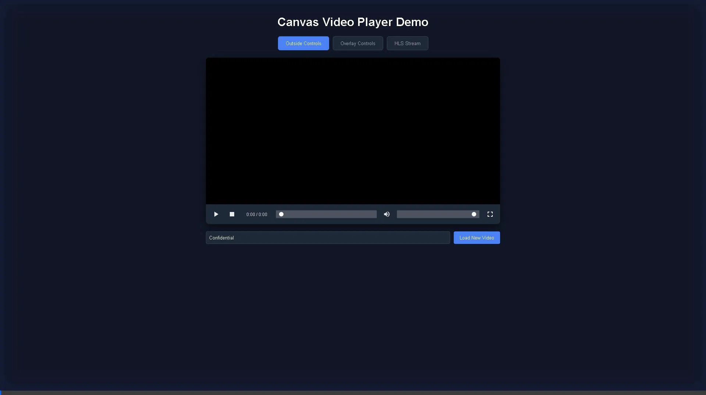

# Canvas Video Player

A lightweight, secure, and customizable JavaScript video player that renders video frames to an HTML Canvas. This approach allows for real-time watermarking, obfuscation of the video source, and custom control layouts.



## Features

*   **Canvas Rendering:** Real-time rendering of video frames to canvas.
*   **Dynamic Watermarking:** "Burn" text into the video display in real-time.
*   **Secure/Obfuscated:** Hides the video source from casual inspection (no right-click save).
*   **Performance:** Optimized rendering loop.
*   **HLS Support:** Streaming support via [hls.js](https://github.com/video-dev/hls.js).
*   **Flexible Controls:** Choose between 'overlay' (floating) or 'outside' (static) control layouts.
*   **Customizable:** Hybrid styling system (Base CSS + Custom Classes).
*   **Modular:** Built as a modern NPM package (ESM & UMD).

---

## Installation

### Option 1: NPM (Recommended)
```bash
npm install canvas-video-player
```

### Option 2: CDN (Static/Browser)
For usage without a build step, you can load the UMD build directly from a CDN like JSDelivr.

```html
<!-- Load CSS -->
<script src="https://cdn.jsdelivr.net/npm/canvas-video-player@latest/dist/style.css"></script>
<!-- Load JS -->
<script src="https://cdn.jsdelivr.net/npm/canvas-video-player@latest/dist/canvas-video-player.umd.js"></script>
```

---

## Quick Start

### ES Modules (Development)
```javascript
import CanvasVideoPlayer from 'canvas-video-player';

const container = document.getElementById('player-container');

const player = new CanvasVideoPlayer(container, {
    videoUrl: 'https://example.com/video.mp4',
    watermarkText: 'Confidential'
});
```

### UMD / Static HTML
```html
<div id="player-container"></div>

<script src="./dist/canvas-video-player.umd.js"></script>
<script>
    const container = document.getElementById('player-container');
    const player = new CanvasVideoPlayer(container, {
        videoUrl: 'https://example.com/video.mp4',
        watermarkText: 'Confidential'
    });
</script>
```

---

## Configuration Guide

### 1. Video Sources

#### Direct MP4 (Standard)
Best for simple use cases and smaller files.
```javascript
const player = new CanvasVideoPlayer(container, {
    videoUrl: 'path/to/video.mp4',
    strategy: 'direct' // Default
});
```

#### HLS Streaming (Recommended for Production)
Best for long videos and adaptive bitrate streaming. Requires `.m3u8` playlist.
```javascript
const player = new CanvasVideoPlayer(container, {
    videoUrl: 'https://example.com/stream.m3u8',
    strategy: 'mse' // Activates HLS handler
});
```

> **FFmpeg Guide: Transcoding to HLS**
> To convert a standard MP4 to HLS format using FFmpeg:
> ```bash
> ffmpeg -i input.mp4 -profile:v baseline -level 3.0 -s 640x360 -start_number 0 -hls_time 10 -hls_list_size 0 -f hls output.m3u8
> ```
> This generates an `output.m3u8` file and multiple `.ts` segment files.

### 2. Controls Layout

#### Overlay (Default)
Controls float on top of the video. Good for immersive experiences.
```javascript
const player = new CanvasVideoPlayer(container, {
    controlsLayout: 'overlay'
});
```

#### Outside
Controls sit in a dedicated row below the video. Good for preserving 100% of the video view.
```javascript
const player = new CanvasVideoPlayer(container, {
    controlsLayout: 'outside'
});
```
*Note: The 'outside' layout adds height to the player container. Ensure your parent container allows for this extra space.*

### 3. Styling & Customization

The player uses a hybrid approach. It injects base styles (`base.css`) for functionality but allows you to override them or add custom classes (e.g., Tailwind).

```javascript
const player = new CanvasVideoPlayer(container, {
    styleConfig: {
        wrapper: 'border-2 border-gray-800 rounded-lg', // Custom wrapper classes
        canvas: 'rounded-t-lg',                         // Custom canvas classes
        controls: 'bg-gray-900 text-white'              // Custom controls container classes
    }
});
```

---

## API Reference

### Constructor Options
| Option | Type | Default | Description |
| :--- | :--- | :--- | :--- |
| `videoUrl` | `string` | `null` | URL of the video source. |
| `watermarkText` | `string` | `''` | Text to display as a watermark. |
| `strategy` | `'direct' \| 'mse'` | `'direct'` | Loading strategy. Use `'mse'` for HLS. |
| `controlsLayout` | `'overlay' \| 'outside'` | `'overlay'` | Position of the controls. |
| `styleConfig` | `object` | `{}` | Object containing custom class names. |

### Methods

#### `load(url)`
Loads a new video URL.
```javascript
player.load('https://example.com/new-video.mp4');
```

#### `play()` / `pause()` / `stop()`
Control playback state. `stop()` resets time to 0.
```javascript
player.play();
```

#### `setWatermark(text)`
Updates the watermark text in real-time.
```javascript
player.setWatermark('New Watermark Text');
```

#### `destroy()`
Cleans up event listeners and DOM elements. Call this before removing the player.
```javascript
player.destroy();
```

---

## Development

1.  **Clone & Install**
    ```bash
    git clone <repo-url>
    npm install
    ```

2.  **Run Dev Server**
    ```bash
    npm run dev
    ```
    Opens the **Dev Demo** (`demo-dev.html`) with tabs for testing all configurations.

3.  **Build for Production**
    ```bash
    npm run build
    ```
    Generates `dist/` folder with UMD and ESM builds.

## License

MIT

## AI Disclaimer

This project has been created using AI, LLM models, agents and related tools.