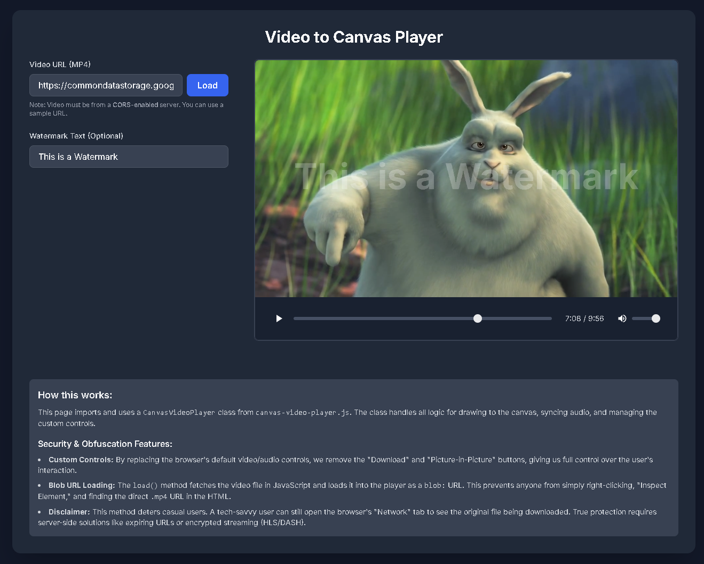

# Canvas Video Player

A lightweight, dependency-free JavaScript class for playing MP4 videos on an HTML canvas. This provides a secure way to display watermarked video content by hiding the source URL and preventing easy downloads.

The player renders video frames to a `<canvas>` element while playing the audio from a synchronized, hidden `<audio>` element. It replaces the default browser controls with a custom, secure UI.



## Features

  * **Canvas Rendering:** Video frames are drawn directly onto a `<canvas>`, allowing for real-time watermarking.
  * **Dynamic Watermarking:** Apply and update a text watermark that is "burned" into the visible canvas frames.
  * **Custom Secure Controls:** A clean, custom-built player UI (play/pause, timeline, volume, mute) that *removes* the browser's default "Download" button.
  * **URL Obfuscation:** Fetches the video and loads it as a `blob:` URL. This hides the original `.mp4` source from the "Inspect Element" panel, deterring casual video theft.
  * **Responsive & Styled:** Built with modern CSS and SVGs, designed to be easily dropped into any page (Tailwind CSS used for the demo).

## How to Use

### 1. Include the Files

Add the `canvas-video-player.js` file to your project. 

```html

<script src="https://cdn.jsdelivr.net/gh/hasielhassan/CanvasVideoPlayerJS@v0.0.2/canvas-video-player.js"></script>

```

You also need a basic HTML structure.

```html
<!DOCTYPE html>
<html>
<head>
    <!-- Add your own styles for the page -->
    <link rel="stylesheet" href="styles.css">
    
    <!-- 
      Add the player's CSS for the sliders and controls.
      (You can copy this from the demo's <style> tag)
    -->
    <style>
        input[type="range"].slider { ... }
        .control-button { ... }
        /* ... etc ... */
    </style>
</head>
<body>

    <h1>My Secure Video</h1>

    <!-- 1. Create a container div for the player -->
    <div id="my-player-container">
        <!-- The player will be built here -->
    </div>

    <!-- 2. Include the player script -->
    <script src="canvas-video-player.js"></script>

    <!-- 3. Initialize the player -->
    <script>
        const container = document.getElementById('my-player-container');
        
        const player = new CanvasVideoPlayer(container, {
            videoUrl: '[https://your-server.com/path/to/video.mp4](https://your-server.com/path/to/video.mp4)',
            watermarkText: 'Confidential'
        });
    </script>

</body>
</html>
````

### 2\. Initialization

Create a new instance of the `CanvasVideoPlayer` class, passing in the container element and an options object.

```javascript
const container = document.getElementById('player-container');
const player = new CanvasVideoPlayer(container, {
    videoUrl: 'https://path/to/your/video.mp4',
    watermarkText: 'Optional Watermark'
});
```

The `videoUrl` is loaded immediately on construction.

### 3\. Public API Methods

You can interact with the player instance after it's created.

#### `.load(videoUrl)`

Loads a new video into the player. This is an `async` function.

```javascript
// Example: Load a new video from a button click
myButton.addEventListener('click', () => {
    player.load('https://path/to/another-video.mp4');
});
```

#### `.setWatermark(text)`

Updates the watermark text in real-time. If the video is paused, the canvas will redraw with the new text immediately.

```javascript
// Example: Update watermark from an input field
myInput.addEventListener('input', (e) => {
    player.setWatermark(e.target.value);
});
```

#### `.destroy()`

Safely removes the player, cleans up event listeners, and revokes any active `blob:` URLs to prevent memory leaks.

```javascript
// Example: Remove the player
myRemoveButton.addEventListener('click', () => {
    player.destroy();
});
```

## Security & Obfuscation

This player is designed to deter *casual* users from downloading your video.

  * **No Download Button:** The custom controls do not have a download option.
  * **Blob URL:** The player `fetches` the video and sets the `<video>` and `<audio>` source to a local `blob:` URL. This means "Inspect Element" will only show `src="blob:http://..."`, not your actual `.mp4` URL.

**Limitation:** This does **not** stop a tech-savvy user. A user who opens the **Network Tab** in their browser's developer tools *before* loading the video will still be able to see the original `.mp4` file being downloaded.

For true, high-level security, you must implement server-side solutions like **expiring (signed) URLs** or **encrypted streaming (HLS/DASH)**. This player provides a strong, client-side first line of defense.
